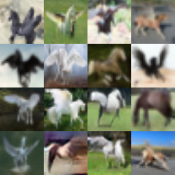

# Ping Pong Training for GANs

This repo contains proof of concept results for a simple (and I think novel) idea that I had that can facilitate training a GAN to interpolate the latent space between any number of classes.

### Idea

The most common approach to this problem that I've seen is to first train your generative model, and then after the fact to some form of interpolation to hopefully get something resembling your desired output. [Here](https://github.com/soumith/dcgan.torch/issues/14) is a good discussion about this.

The idea here is instead is to try and bring this interpolation into the learning phase. We do this by training the same generator and discriminator on one class, and then continuing the training on the next, and so on, however many times as desired. We call this repeated changing of class ping-ponging. By doing this, we hope to learn a better way to sample from the latent space that combines features from each class in a more realistic way then just by interpolation after the fact.

In my experiments, I found that initially a lot of time should be spent in the class you want the output to be most similar to, and then start to ping-pong, slowly reducing the number of epochs of training spent on each class as you converge. I also tried reducing the LR with SGD or increasing the batch size in place of or as well as reducing the number of epochs, but I generally found that the best setup was to reduce the number of epochs and use Adam.

### Results

Here's a batch of results that I created by trying to generate a Pegasus from the horse and bird categories in CIFAR-10.
I've just adapted the DCGAN implementation provided in the PyTorch examples.

